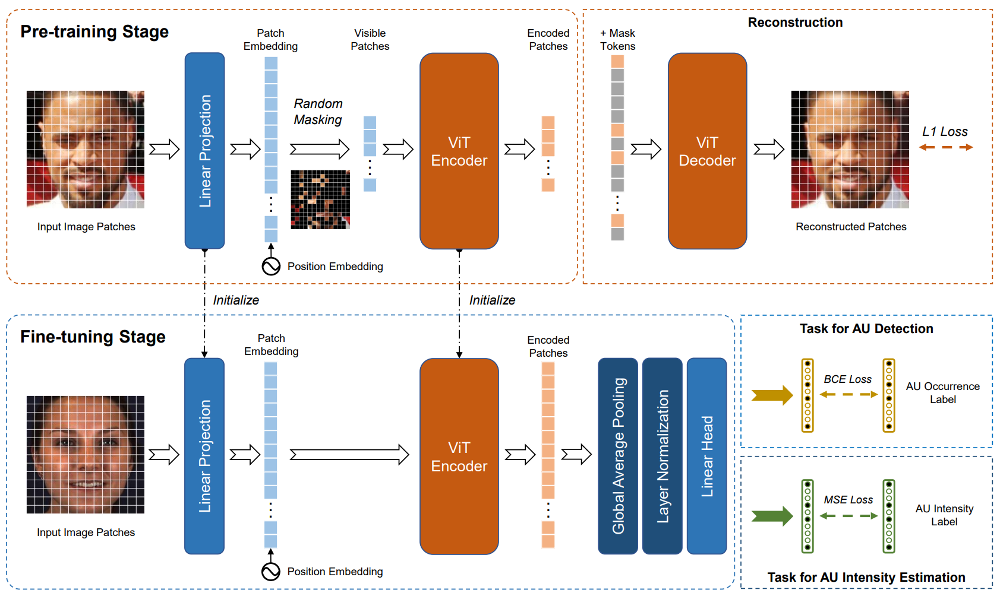

## Masked Autoencoders for Facial Unit Intensity Estimation: A PyTorch Implementation

<p align="center">
  
</p>


This is an adapted PyTorch/GPU implementation of the following paper specifically to be used for facial action unit intensity estimation:

[Masked Autoencoders Are Scalable Vision Learners](https://arxiv.org/abs/2111.06377)
```
@Article{MaskedAutoencoders2021,
  author  = {Kaiming He and Xinlei Chen and Saining Xie and Yanghao Li and Piotr Doll{\'a}r and Ross Girshick},
  journal = {arXiv:2111.06377},
  title   = {Masked Autoencoders Are Scalable Vision Learners},
  year    = {2021},
}
```

* This repo is a modification on the [Facebook Research MAE repo](https://github.com/facebookresearch/mae). Installation and preparation follow that repo.

* This repo is based on [`timm==0.3.2`](https://github.com/rwightman/pytorch-image-models), for which a [fix](https://github.com/rwightman/pytorch-image-models/issues/420#issuecomment-776459842) is needed to work with PyTorch 1.8.1+.

### Catalog

- [x] Custom images demo

### Custom images demo

To run the demo to see example output on custom images, please follow these steps:

  1. Install dependencies.
      
      ```pip install -r requirements.txt```

  2. Crop face images to 224x224 with face centered. Place images in a directory (e.g. /test_imgs).

  3. Download [model checkpoint](https://drive.google.com/file/d/1UWKZOc9hGY_699HNdrHkZRaSZhuEiuR8/view?usp=sharing).

  4. Run the following command.

      ``` python test.py --checkpoint [PATH_TO_CHECKPOINT] --model vit_base_patch16 --nb_classes 14 --image_dir [PATH_TO_IMAGE_DIRECTORY]```

### License

This project is under the CC-BY-NC 4.0 license. See [LICENSE](LICENSE) for details.
